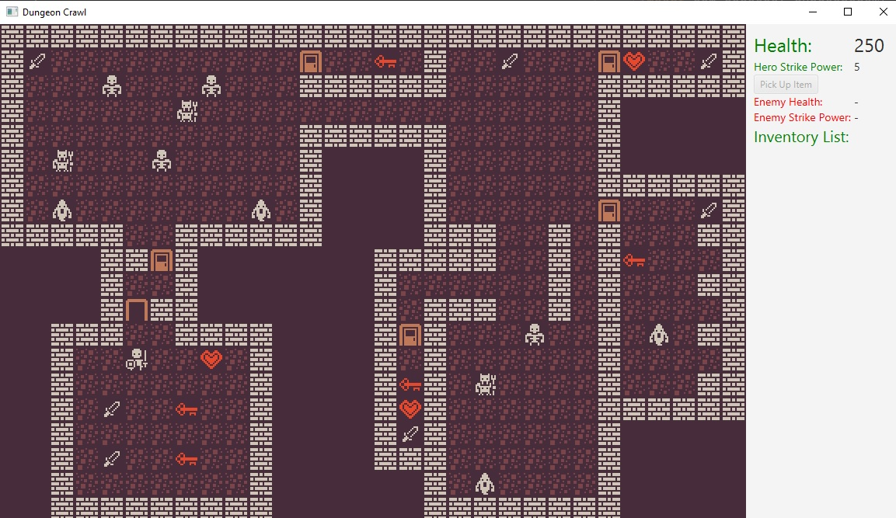

# Dungeon Crawl
[Roguelikes](https://en.wikipedia.org/wiki/Roguelike) are one of the oldest
types of video games, the earliest ones were made in the 70s, they were inspired
a lot by tabletop RPGs. Roguelikes have the following in common usually:

- They are tile-based.
- The game is divided into turns, e.g. you make one action, then the other
  entities (monsters, allies, etc. controlled by the CPU) make one.
- Usually the task is to explore a labyrinth and retrieve some treasure from its
  bottom.
- They feature permadeath: if you die its game over, you need to start from the
  beginning again.
- Are heavily using procedural generation: Levels, monster placement, items,..
  are randomized, so the game does not get boring.
## Author
- Dariusz Okonski

## Technologies
- Java
- JavaFx
